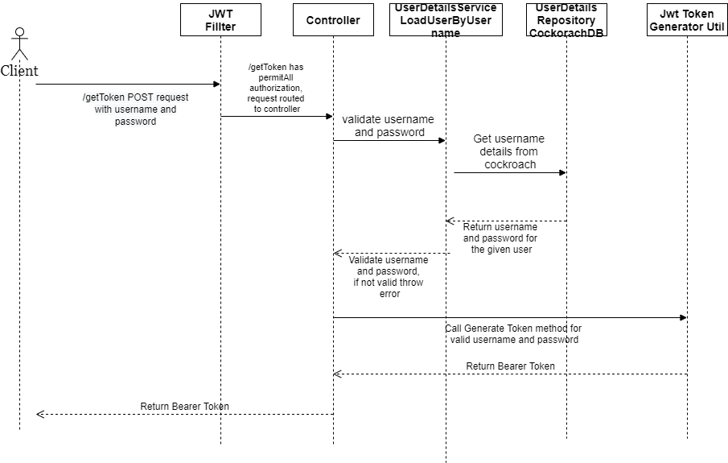

## **Cockroach DB - Generate adfs token by User Authentication**

This repo contains example of generating adfs token by validating whether the username/password present in Cockorach DB

## Process Flow

  
  
## Cockroach DB Secure Cluster Creation
  
######   Genarate certificate:
 
  
    mkdir certs secure_cluster;
    cockroach cert create-ca --certs-dir=certs --ca-key=secure_cluster/ca.key;
    cockroach cert create-node localhost 26257 --certs-dir=certs --ca-key=secure_cluster/ca.key;
    cockroach cert create-client root --certs-dir=certs --ca-key=secure_cluster/ca.key;
  
######   Create a secure cluster:
    
    cockroach start --certs-dir=certs --store=node1 --listen-addr=localhost:26257 --http-addr=localhost:8080;
  
######   Create User and password:
 
    cockroach sql --certs-dir=certs --host=localhost:26257
    CREATE USER IF NOT EXISTS dbuser;
  
######   Create Database:
  
    CREATE DATABASE TRACKER;
    SET DATABASE = TRACKER;
    GRANT ALL ON DATABASE TRACKER TO dbuser;
  
  
######   Generate Certificate for dbuser user:
  
    cockroach cert create-client dbuser --certs-dir=certs --ca-key=secure_cluster/ca.key --also-generate-pkcs8-key;
  
  
######   DB Url:
  
    jdbc:postgresql://localhost:26257/tracker?ssl=true&sslmode=require&sslrootcert=certs/ca.crt&sslkey=certs/client.dbuser.key.pk8&sslcert=certs/client.dbuser.crt
  
######   Create table:
  
    CREATE TABLE TRACKER.USERS (
      USER_ID SERIAL PRIMARY KEY, USERNAME STRING, PASSWORD STRING, ROLE STRING
    );
  
    insert into tracker.users(username,password,role) values ('Dileepan','dileepan','admin');
    
#### Cockroach Dependencies:
 
 Used postgresql driver to interact with cockroach DB
 
        <dependency>
             <groupId>org.postgresql</groupId>
             <artifactId>postgresql</artifactId>
             <version>42.2.18</version>
         </dependency>